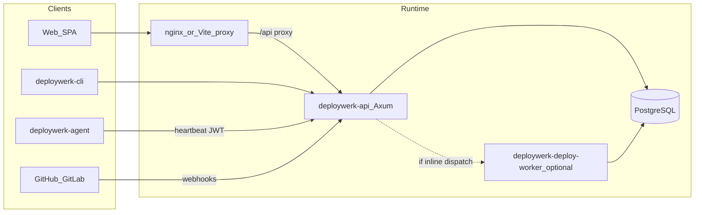

# DeployWerk V2 — specification, implementation status, and backlog

**Purpose:** Single source of truth for **what the product is meant to be** (enterprise spec), **what this repository implements today** (functional + technical), and **what remains pending** (gaps, placeholders, roadmap).

**Related:** The formal product specification lives under [docs/spec/](spec/00-overview.md) (intended surface, not a line-by-line code map). Day-to-day implementation truth is in `crates/`, `web/`, and SQL migrations.

- **Prioritized enterprise gap backlog (P0–P3):** [ENTERPRISE_GAPS.md](ENTERPRISE_GAPS.md)
- **Mail platform (Stalwart, transactional API, phased delivery):** [spec/08-mail-platform.md](spec/08-mail-platform.md)
- **Capability → code entry points (thin index):** [LOGICAL_CAPABILITY_MAP.md](LOGICAL_CAPABILITY_MAP.md)

**Last reviewed:** 2026-06-15 (repository snapshot).

---

## Executive summary

DeployWerk V2 is a **Rust API** (`deploywerk-api`), **optional external deploy worker** (`deploywerk-deploy-worker`), **CLI** (`deploywerk-cli`), **minimal host agent** (`deploywerk-agent`), and a **Vite + React** web app. The stack targets **PostgreSQL**, optional **Docker** on the API host for “platform” deploys, optional **OIDC (e.g. Authentik)**, **SCIM**, **GitHub/GitLab webhooks**, and **SMTP** for transactional mail.

**What is production-usable today (MVP):**

- Multi-tenant **organizations and teams**, membership, invitations, API tokens, and **RBAC** scoped to team/org/application (see [rbac.rs](../crates/deploywerk-api/src/rbac.rs)).
- **Projects → environments → applications** with Docker images, env vars, domains, optional runtime volumes, deploy locks / schedules on environments.
- **Deploy jobs**: enqueue, approve (when required), run (inline API process or external worker), **rollback**, **SSE log streaming**, team deployment list, Git metadata on jobs.
- **SSH servers** with encrypted private keys, validation, and **remote Docker** inspection/control endpoints.
- **Destinations** (`docker_standalone` on a server, `docker_platform` on the API host when enabled).
- **Team secrets** (encrypted) and **`dw_secret:NAME`** resolution in application env at deploy time.
- **Notification endpoints** (HTTP/Discord) for deploy events; optional **email** notifications when SMTP is configured.
- **Platform admin** UI + `/api/v1/admin/*` for users, orgs, teams, billing metadata, entitlements, audit log, system summary.
- **Git automation (partial):** GitHub/GitLab push hooks, GitHub App path for PR previews (when configured), branch patterns and optional image build-from-git on the worker.

**What is preview / placeholder / contract-only:**

- Many “platform” surfaces from the enterprise spec exist as **APIs + DB tables + UI panels** but are **not full product features** yet: **OTLP** persists **raw batches** with list/download APIs (not a trace explorer); **registry** and **cost** endpoints are **stubs**; **firewall** rules are stored + Traefik snippet export, not enforced by DeployWerk; **CDN purge** is an audit log of intent; **RUM**, **AI gateway** proxy, **feature flags**, **usage** counters are early slices.
- The **agent** today is a **heartbeat** client only—not deploy execution, log shipping, or metrics as described in the long-term spec.

**What is not implemented (vs enterprise spec):**

- First-class **OCI registry**, image scanning/signing, blue/green and canary **traffic shifting**, advanced **policy engine (OPA)**, **production-hardened SAML** (experimental ACS exists behind a flag), full **observability platform** (metrics/time-series + trace UI), **IaC providers**, **visual pipeline builder**, **no-code site builder**, **marketplace/WASM extensions**, and most **enterprise continuity** (DR, GitOps reconciliation, SLO gates)—as described in [docs/spec/03](spec/03-deploy-lifecycle-registry.md)–[07](spec/07-operations-enterprise.md).
- **Team-managed mail platform** per [spec/08-mail-platform.md](spec/08-mail-platform.md): **Phase 1 slice only** — `mail_domains` / transactional send API (`mail_platform.rs`) and settings UI; **Stalwart provisioning, JMAP webmail, and DNS wizard** are not implemented.

---

## How this document relates to `docs/spec/*`

| Document | Role |
|----------|------|
| [spec/00-overview.md](spec/00-overview.md) | Vision, capability zones, summary matrix (intended vs optional). |
| [spec/01-actors-identity-orgs.md](spec/01-actors-identity-orgs.md) | Identity, orgs, teams, invites—**partially** implemented (TOTP MFA + org `mfa_required` for local accounts; experimental SAML behind env flag; no passkeys/session revoke UI). |
| [spec/02-projects-through-applications.md](spec/02-projects-through-applications.md) | Projects/env/apps/servers—**core CRUD + deploy** implemented; many advanced app features are not. |
| [spec/03-deploy-lifecycle-registry.md](spec/03-deploy-lifecycle-registry.md) | Deploy/rollback/logs—**MVP**; registry and advanced strategies largely **not**. |
| [spec/04-security-rbac-secrets-compliance.md](spec/04-security-rbac-secrets-compliance.md) | Team secrets + RBAC—**partial**; KMS, OPA, full audit/compliance—**not**. |
| [spec/05-platform-networking-iac-observability.md](spec/05-platform-networking-iac-observability.md) | Edge/observability/IaC—**mostly not**; health checks + OTLP raw batch store + firewall/CDN placeholders—**partial**. |
| [spec/06-developer-experience-and-data.md](spec/06-developer-experience-and-data.md) | Portal/pipelines/builder/DB mgmt—**not** in this repo. |
| [spec/07-operations-enterprise.md](spec/07-operations-enterprise.md) | Billing hooks, admin, notifications—**partial** (admin + webhooks + stubs). |
| [spec/08-mail-platform.md](spec/08-mail-platform.md) | Team mail—**partial** (schema + transactional SMTP send behind `DEPLOYWERK_MAIL_ENABLED`, domain CRUD + stub DNS check API + settings UI); Stalwart/JMAP/webmail not implemented. |

---

## Status taxonomy

Every capability below is labeled:

| Label | Meaning |
|-------|---------|
| **Implemented** | End-to-end for a defined workflow; users can complete the task in UI and/or API without “coming soon” caveats in code. |
| **Partial** | Real persistence or execution, but limited semantics, operator setup, or missing UI/CLI parity. |
| **Placeholder** | Schema/API/UI “contract” exists; little or no core processing, enforcement, or analytics as in the spec. |
| **Not implemented** | No meaningful code path; spec is aspirational for this repo. |

---

## Technical architecture (this repository)

**Evidence:**

- API composition and middleware: [lib.rs](../crates/deploywerk-api/src/lib.rs) (`handlers`, `oidc`, `scim`, `team_platform`, migrations on startup).
- Web API base URL / proxy: [api.ts](../web/src/api.ts), root [README.md](../README.md).
- External worker: [deploywerk_deploy_worker.rs](../crates/deploywerk-api/src/bin/deploywerk_deploy_worker.rs), `DEPLOYWERK_DEPLOY_DISPATCH` in [README.md](../README.md).

---

## Implemented — functional (by area)

### Identity, session, and access

| Capability | Status | Notes / evidence |
|------------|--------|-------------------|
| Email + password register/login | **Partial** | Gated by `allow_local_password_auth`; [handlers.rs](../crates/deploywerk-api/src/handlers.rs). |
| JWT session | **Implemented** | Bearer token; [auth.rs](../crates/deploywerk-api/src/auth.rs). |
| API tokens (read/write/deploy scopes, optional expiry + CIDR allowlist) | **Partial** | [handlers.rs](../crates/deploywerk-api/src/handlers.rs) `/api/v1/tokens`; enforcement [auth.rs](../crates/deploywerk-api/src/auth.rs) (`allowed_cidrs`, `X-Forwarded-For` / `X-Real-IP`). |
| OIDC (e.g. Authentik) | **Partial** | [oidc.rs](../crates/deploywerk-api/src/oidc.rs); UI callback [OidcCallbackPage.tsx](../web/src/pages/OidcCallbackPage.tsx). |
| SCIM provisioning | **Partial** | [scim.rs](../crates/deploywerk-api/src/scim.rs); operator bearer + IdP issuer env. |
| TOTP MFA + org MFA policy (local password) | **Partial** | [mfa.rs](../crates/deploywerk-api/src/mfa.rs), [organizations.rs](../crates/deploywerk-api/src/organizations.rs) `mfa_required`, login [handlers.rs](../crates/deploywerk-api/src/handlers.rs). |
| SAML 2.0 (experimental) | **Partial** | [saml.rs](../crates/deploywerk-api/src/saml.rs); requires explicit insecure/product flags for ACS. |
| Passkeys, session revoke UI | **Not implemented** | Spec [01](spec/01-actors-identity-orgs.md). |

### Organizations and teams

| Capability | Status | Notes / evidence |
|------------|--------|-------------------|
| Org CRUD, members, transfer owner | **Implemented** | [organizations.rs](../crates/deploywerk-api/src/organizations.rs); UI org settings. |
| Team CRUD under org, team membership | **Implemented** | [organizations.rs](../crates/deploywerk-api/src/organizations.rs), [handlers.rs](../crates/deploywerk-api/src/handlers.rs). |
| Invitations + email | **Partial** | Creates invite + optional SMTP mail; [handlers.rs](../crates/deploywerk-api/src/handlers.rs). |
| Current team/org switch | **Implemented** | `PUT /api/v1/me/current-team`, `.../current-organization`. |

### Projects, environments, applications

| Capability | Status | Notes / evidence |
|------------|--------|-------------------|
| Project CRUD | **Implemented** | [handlers.rs](../crates/deploywerk-api/src/handlers.rs). |
| Environment CRUD + deploy lock + schedule JSON | **Implemented** | [handlers.rs](../crates/deploywerk-api/src/handlers.rs); migration [20260501120000_deploy_control_plane.sql](../crates/deploywerk-api/migrations/20260501120000_deploy_control_plane.sql). |
| Application CRUD, env vars, domains, Git fields | **Implemented** | [applications.rs](../crates/deploywerk-api/src/applications.rs); UI [ApplicationsPage.tsx](../web/src/pages/ApplicationsPage.tsx). |
| Runtime volume mounts | **Partial** | Stored and used by worker; migration [20260414142000_application_runtime_volumes.sql](../crates/deploywerk-api/migrations/20260414142000_application_runtime_volumes.sql). |
| Deploy strategies (blue/green, canary, rolling) | **Partial** | **Fields and job metadata exist**; full orchestration per spec is **not** verified as traffic-shifting—see [applications.rs](../crates/deploywerk-api/src/applications.rs) + control plane migration. |

### Servers and destinations

| Capability | Status | Notes / evidence |
|------------|--------|-------------------|
| SSH server CRUD, encrypted keys | **Implemented** | [servers.rs](../crates/deploywerk-api/src/servers.rs). |
| Server validate (preflight) | **Implemented** | `POST .../validate`. |
| Remote Docker (list/inspect/logs/start/stop/restart) | **Implemented** | Routes under `.../docker/containers` in [servers.rs](../crates/deploywerk-api/src/servers.rs). |
| Destinations | **Implemented** | [destinations.rs](../crates/deploywerk-api/src/destinations.rs); platform destination when `DEPLOYWERK_PLATFORM_DOCKER_ENABLED`. |

### Deploy lifecycle

| Capability | Status | Notes / evidence |
|------------|--------|-------------------|
| Enqueue deploy, job status, logs | **Implemented** | [applications.rs](../crates/deploywerk-api/src/applications.rs); global `POST /api/v1/applications/{id}/deploy` in [handlers.rs](../crates/deploywerk-api/src/handlers.rs). |
| Rollback | **Implemented** | Scoped rollback route in [applications.rs](../crates/deploywerk-api/src/applications.rs). |
| Approve deploy (`pending_approval`) | **Implemented** | `POST .../deploy-jobs/{id}/approve`; statuses in migration [20260501120000_deploy_control_plane.sql](../crates/deploywerk-api/migrations/20260501120000_deploy_control_plane.sql). |
| SSE log stream (job + container) | **Implemented** | `.../deploy-jobs/{id}/log-stream`, `.../container-log-stream`. |
| Object storage for large logs/artifacts | **Partial** | Migration [20260414141000_deploy_job_object_storage.sql](../crates/deploywerk-api/migrations/20260414141000_deploy_job_object_storage.sql); requires operator config. |
| Git auto-deploy (push) | **Partial** | Team secrets for hooks; app branch patterns; [webhook_github.rs](../crates/deploywerk-api/src/webhook_github.rs), hooks in [team_platform.rs](../crates/deploywerk-api/src/team_platform.rs); migration [20260421120000_git_auto_deploy.sql](../crates/deploywerk-api/migrations/20260421120000_git_auto_deploy.sql). |
| GitLab push + GitHub App PR preview/destroy | **Partial** | [applications.rs](../crates/deploywerk-api/src/applications.rs) enqueue helpers; migration [20260428120000_gitlab_github_pr_env.sql](../crates/deploywerk-api/migrations/20260428120000_gitlab_github_pr_env.sql). |
| Pre/post deploy HTTP hooks | **Partial** | `pre_deploy_hook_url` / `post_deploy_hook_url` on applications; worker POST in [applications.rs](../crates/deploywerk-api/src/applications.rs) `execute_deploy_job`; migration [20260615121000_application_deploy_hooks.sql](../crates/deploywerk-api/migrations/20260615121000_application_deploy_hooks.sql). |

### Secrets

| Capability | Status | Notes / evidence |
|------------|--------|-------------------|
| Team secret store (encrypted) | **Implemented** | [team_secrets.rs](../crates/deploywerk-api/src/team_secrets.rs); migration [20260502120000_team_secrets.sql](../crates/deploywerk-api/migrations/20260502120000_team_secrets.sql). |
| `dw_secret:NAME` in app env | **Implemented** | Resolver in [team_secrets.rs](../crates/deploywerk-api/src/team_secrets.rs). |
| Secret versioning (`dw_secret:NAME@VERSION`) | **Partial** | [team_secrets.rs](../crates/deploywerk-api/src/team_secrets.rs); migration [20260614121000_team_secret_versions.sql](../crates/deploywerk-api/migrations/20260614121000_team_secret_versions.sql). |
| KMS, rotation policies | **Not implemented** | Spec [04](spec/04-security-rbac-secrets-compliance.md). |

### Notifications and email

| Capability | Status | Notes / evidence |
|------------|--------|-------------------|
| Notification endpoints (HTTP, Discord, Telegram, email) | **Implemented** | [notifications.rs](../crates/deploywerk-api/src/notifications.rs); DB allows `generic_http`, `discord_webhook`, `telegram`, `email` per [20260428120100_notification_email_kind.sql](../crates/deploywerk-api/migrations/20260428120100_notification_email_kind.sql); `email` requires instance SMTP. |
| Transactional SMTP (invites, email channel) | **Partial** | [mail.rs](../crates/deploywerk-api/src/mail.rs); team mail API [mail_platform.rs](../crates/deploywerk-api/src/mail_platform.rs) when `DEPLOYWERK_MAIL_ENABLED=true`. |

### Platform administration

| Capability | Status | Notes / evidence |
|------------|--------|-------------------|
| Admin API | **Implemented** | [admin.rs](../crates/deploywerk-api/src/admin.rs) (`/api/v1/admin/*`). |
| Admin UI | **Implemented** | [App.tsx](../web/src/App.tsx) `/admin/*`, pages under [admin/](../web/src/pages/admin/). |
| Entitlements / feature gating | **Partial** | [entitlements.rs](../crates/deploywerk-api/src/entitlements.rs) + admin entitlements routes. |

### Team audit and compliance (non-admin)

| Capability | Status | Notes / evidence |
|------------|--------|-------------------|
| Team audit log | **Partial** | Table `team_audit_log`; list API; [audit.rs](../crates/deploywerk-api/src/audit.rs); settings [TeamAuditSettingsPage.tsx](../web/src/pages/app/settings/TeamAuditSettingsPage.tsx); instrumentation growing (e.g. secrets, servers, approvals, members, deploy enqueue, app delete). |

### “Platform” team APIs (MVP vs stub)

| Capability | Status | Notes / evidence |
|------------|--------|-------------------|
| Usage (deploy counts) | **Partial** | `GET .../usage`; [team_platform.rs](../crates/deploywerk-api/src/team_platform.rs). |
| Support links | **Implemented** | `.../support-links`; UI [placeholders.tsx](../web/src/pages/app/placeholders.tsx). |
| Storage backends (S3-compatible, encrypted creds) | **Partial** | CRUD + test; [team_platform.rs](../crates/deploywerk-api/src/team_platform.rs). |
| Feature flags (JSON per team/env) | **Partial** | CRUD; [team_platform.rs](../crates/deploywerk-api/src/team_platform.rs). |
| Health checks + results + background loop | **Partial** | CRUD + [team_platform.rs](../crates/deploywerk-api/src/team_platform.rs) / `run_health_check_loop` in [lib.rs](../crates/deploywerk-api/src/lib.rs). |
| Team search | **Partial** | `GET .../search`. |
| Firewall rules + Traefik snippet | **Placeholder** | Stored + export; not enforced by DeployWerk edge. |
| CDN purge requests | **Placeholder** | Audit-style log; no CDN integration. |
| Preview deployment rows | **Partial** | List/manual create + webhook-driven flows. |
| Agent registration + heartbeat | **Partial** | [team_platform.rs](../crates/deploywerk-api/src/team_platform.rs), [main.rs](../crates/deploywerk-agent/src/main.rs). |
| RUM ingest + summary | **Partial** | Routes in [team_platform.rs](../crates/deploywerk-api/src/team_platform.rs); table `rum_events`. |
| AI gateway routes + invoke proxy | **Partial** | [team_platform.rs](../crates/deploywerk-api/src/team_platform.rs); review security before production use. |
| Team billing record | **Partial** | `GET/PATCH .../billing`; admin billing list. |
| OTLP traces | **Partial** | `POST .../otlp/v1/traces` persists raw batch (`otlp_trace_batches`); list/get + retention in [team_platform.rs](../crates/deploywerk-api/src/team_platform.rs); UI list/download on Observability page. |
| Registry status | **Placeholder** | `integrated: false` stub in [team_platform.rs](../crates/deploywerk-api/src/team_platform.rs). |
| Cost summary | **Placeholder** | Stub JSON in [team_platform.rs](../crates/deploywerk-api/src/team_platform.rs). |
| Stripe / Adyen / Mollie webhooks | **Partial** | Routes in [team_platform.rs](../crates/deploywerk-api/src/team_platform.rs); operator secrets in [lib.rs](../crates/deploywerk-api/src/lib.rs) `AppState`. |

### CLI

| Capability | Status | Notes / evidence |
|------------|--------|-------------------|
| Auth, teams, projects, envs, tokens, deploy trigger, servers, destinations, applications, orgs, invitations | **Partial** | [main.rs](../crates/deploywerk-cli/src/main.rs)—coverage exists but is **not** guaranteed to match every API; use API as final authority. |

---

## Implemented — technical reference

### HTTP API modules (Rust)

| Module | Responsibility |
|--------|----------------|
| [handlers.rs](../crates/deploywerk-api/src/handlers.rs) | Core routes: health, bootstrap, auth, me, teams, projects, envs, tokens, invitations, global deploy. |
| [organizations.rs](../crates/deploywerk-api/src/organizations.rs) | Organizations, org teams, org members, transfer. |
| [servers.rs](../crates/deploywerk-api/src/servers.rs) | SSH servers, validation, Docker remote API. |
| [destinations.rs](../crates/deploywerk-api/src/destinations.rs) | Destinations; platform destination helper. |
| [applications.rs](../crates/deploywerk-api/src/applications.rs) | Applications, deploy jobs, streams, webhooks helpers. |
| [team_secrets.rs](../crates/deploywerk-api/src/team_secrets.rs) | Team secrets + `dw_secret` resolution. |
| [notifications.rs](../crates/deploywerk-api/src/notifications.rs) | Notification endpoints. |
| [team_platform.rs](../crates/deploywerk-api/src/team_platform.rs) | Usage, support, storage, flags, OTLP batch ingest/list, team audit list, hooks, billing webhooks, etc. |
| [audit.rs](../crates/deploywerk-api/src/audit.rs) | Team audit log writes (`try_log_team_audit`). |
| [mfa.rs](../crates/deploywerk-api/src/mfa.rs) | TOTP enrollment/verify. |
| [saml.rs](../crates/deploywerk-api/src/saml.rs) | Experimental SAML metadata/ACS/IdP CRUD. |
| [mail_platform.rs](../crates/deploywerk-api/src/mail_platform.rs) | Mail domains CRUD, transactional send, message status. |
| [admin.rs](../crates/deploywerk-api/src/admin.rs) | Platform admin. |
| [oidc.rs](../crates/deploywerk-api/src/oidc.rs) | OIDC discovery + callback. |
| [scim.rs](../crates/deploywerk-api/src/scim.rs) | SCIM endpoints. |
| [webhook_github.rs](../crates/deploywerk-api/src/webhook_github.rs) | GitHub HMAC verification. |
| [rbac.rs](../crates/deploywerk-api/src/rbac.rs), [auth.rs](../crates/deploywerk-api/src/auth.rs) | Authorization + authentication. |

### Web UI routes (React)

Main router: [App.tsx](../web/src/App.tsx). Lazy-loaded pages: [lazyPages.ts](../web/src/lazyPages.ts).

- **Marketing / auth:** `/`, `/pricing`, `/login`, `/register`, `/demo`, `/invite/:token`, legal pages.
- **App shell (`/app`):** dashboard, org settings, projects, environments, applications, servers, destinations, deployments, logs, domains, search, settings (general, team, notifications, billing, secrets, domains, audit log, mail domains).
- **Platform-style pages:** analytics, speed-insights, observability, firewall, CDN, integrations, storage, flags, agent, AI gateway, sandboxes (Git hooks), usage, support—implemented in [placeholders.tsx](../web/src/pages/app/placeholders.tsx) and [platform/](../web/src/pages/app/platform/).
- **Admin (`/admin`):** users, orgs, teams, billing, pricing, audit, system.

### Database migrations (PostgreSQL)

All under [migrations/](../crates/deploywerk-api/migrations/). Notable:

| Migration | Purpose |
|-----------|---------|
| [20260115120000_initial_postgres.sql](../crates/deploywerk-api/migrations/20260115120000_initial_postgres.sql) | Base schema (users, teams, projects, apps, deploy_jobs, …). |
| [20260411130000_servers.sql](../crates/deploywerk-api/migrations/20260411130000_servers.sql) | SSH servers. |
| [20260412120000_destinations.sql](../crates/deploywerk-api/migrations/20260412120000_destinations.sql) | Destinations. |
| [20260412130000_applications_deploy_jobs.sql](../crates/deploywerk-api/migrations/20260412130000_applications_deploy_jobs.sql) | Applications + jobs. |
| [20260412140000_application_env_domains.sql](../crates/deploywerk-api/migrations/20260412140000_application_env_domains.sql) | Env vars / domains. |
| [20260414141000_deploy_job_object_storage.sql](../crates/deploywerk-api/migrations/20260414141000_deploy_job_object_storage.sql) | Object storage keys on jobs. |
| [20260414142000_application_runtime_volumes.sql](../crates/deploywerk-api/migrations/20260414142000_application_runtime_volumes.sql) | Volume mounts. |
| [20260420120000_placeholder_surfaces.sql](../crates/deploywerk-api/migrations/20260420120000_placeholder_surfaces.sql) | Notification endpoints, support links, storage backends, flags, health checks, firewall, CDN, previews, agents, RUM, AI routes, team billing, user prefs. |
| [20260421120000_git_auto_deploy.sql](../crates/deploywerk-api/migrations/20260421120000_git_auto_deploy.sql) | Git auto-deploy fields. |
| [20260422140000_git_build_deploy.sql](../crates/deploywerk-api/migrations/20260422140000_git_build_deploy.sql) | Build-from-git fields. |
| [20260423120000_organizations.sql](../crates/deploywerk-api/migrations/20260423120000_organizations.sql) | Organizations. |
| [20260425120000_platform_admin.sql](../crates/deploywerk-api/migrations/20260425120000_platform_admin.sql) | Platform admin + admin audit. |
| [20260426120000_authentik_scim.sql](../crates/deploywerk-api/migrations/20260426120000_authentik_scim.sql) | SCIM-related columns/tables. |
| [20260427120000_platform_docker_hostnames.sql](../crates/deploywerk-api/migrations/20260427120000_platform_docker_hostnames.sql) | Platform Docker hostnames. |
| [20260428120000_gitlab_github_pr_env.sql](../crates/deploywerk-api/migrations/20260428120000_gitlab_github_pr_env.sql) | GitLab secret, PR preview, GitHub App installations. |
| [20260429120000_deploy_jobs_git_base_checks.sql](../crates/deploywerk-api/migrations/20260429120000_deploy_jobs_git_base_checks.sql) | Git base SHA for compares. |
| [20260430120000_rollback_runtime_logs.sql](../crates/deploywerk-api/migrations/20260430120000_rollback_runtime_logs.sql) | Rollback + runtime logs. |
| [20260501120000_deploy_control_plane.sql](../crates/deploywerk-api/migrations/20260501120000_deploy_control_plane.sql) | Env locks/schedules, deploy strategies, approvals, job statuses. |
| [20260502120000_team_secrets.sql](../crates/deploywerk-api/migrations/20260502120000_team_secrets.sql) | `team_secrets`. |
| [20260503120000_audit_chain_hint.sql](../crates/deploywerk-api/migrations/20260503120000_audit_chain_hint.sql) | Audit chain hint. |
| [20260504120000_application_memberships.sql](../crates/deploywerk-api/migrations/20260504120000_application_memberships.sql) | Application-level roles. |
| [20260504130000_more_perf_indexes.sql](../crates/deploywerk-api/migrations/20260504130000_more_perf_indexes.sql) | Indexes. |
| [20260614120000_otlp_trace_batches.sql](../crates/deploywerk-api/migrations/20260614120000_otlp_trace_batches.sql) | Raw OTLP batch storage. |
| [20260614121000_team_secret_versions.sql](../crates/deploywerk-api/migrations/20260614121000_team_secret_versions.sql) | Secret version history. |
| [20260614122000_team_audit_log.sql](../crates/deploywerk-api/migrations/20260614122000_team_audit_log.sql) | Team audit log. |
| [20260614123000_api_tokens_expiry.sql](../crates/deploywerk-api/migrations/20260614123000_api_tokens_expiry.sql) | API token `expires_at`. |
| [20260614124000_org_mfa_and_saml.sql](../crates/deploywerk-api/migrations/20260614124000_org_mfa_and_saml.sql) | Org MFA, TOTP, SAML IdP tables. |
| [20260614125000_mail_platform_phase1.sql](../crates/deploywerk-api/migrations/20260614125000_mail_platform_phase1.sql) | `mail_domains`, `mail_messages`. |
| [20260615120000_api_tokens_allowed_cidrs.sql](../crates/deploywerk-api/migrations/20260615120000_api_tokens_allowed_cidrs.sql) | Per-token CIDR allowlist. |
| [20260615121000_application_deploy_hooks.sql](../crates/deploywerk-api/migrations/20260615121000_application_deploy_hooks.sql) | Pre/post deploy hook URLs. |

### Deploy dispatch modes

- **Inline:** API process runs job execution (default when not `external`).
- **External:** Jobs stay `queued` until [deploywerk-deploy-worker](../crates/deploywerk-api/src/bin/deploywerk_deploy_worker.rs) runs; see [lib.rs](../crates/deploywerk-api/src/lib.rs) `deploy_dispatch_inline` / `DEPLOYWERK_DEPLOY_DISPATCH`.

---

## Pending and gaps (actionable)

### Enterprise backlog summary (by priority)

The full tables and spec cross-links live in **[ENTERPRISE_GAPS.md](ENTERPRISE_GAPS.md)**. Roll-up:

**P0 (blockers for “enterprise credible”):** **SAML hardening** (signatures, metadata, operator UX), **MFA for OIDC-only orgs** if required, **audit completeness** (expand instrumentation + exports), **OTLP** product story (explorer vs external backend). See [ENTERPRISE_GAPS.md](ENTERPRISE_GAPS.md) for refreshed deltas.

**P1 (high customer expectation):** Session listing/revocation, step-up auth, **KMS**-wrapped secrets, registry + CVE gate, **traffic-aware** blue/green/canary, metrics + searchable logs, agent v2 scope, edge/proxy story, dev portal/provisioning, quotas at deploy time, config backup/restore—and **mail Phase 1+** (Stalwart, live DNS checks, webmail) per [spec/08](spec/08-mail-platform.md).

**Mail epic:** Phases 1–3 and release criteria are defined only in [spec/08-mail-platform.md](spec/08-mail-platform.md); track alongside P0/P1 themes (see [Maturity-based roadmap](#maturity-based-roadmap-non-binding) below).

**P2 / P3:** Custom RBAC, ABAC, OPA, GitOps/IaC providers, SLO engine, CAB, SPIFFE, etc.—see ENTERPRISE_GAPS.

### Relative to enterprise spec (major themes)

1. **Container registry** — No bundled OCI registry; stub only ([team_platform.rs](../crates/deploywerk-api/src/team_platform.rs)). Spec: [03](spec/03-deploy-lifecycle-registry.md).
2. **Advanced deploy strategies** — Schema/UI/API may expose strategy enums; **traffic management** (canary/blue-green) as in spec is not fully realized.
3. **Observability platform** — Health checks exist; **OTLP** stores raw batches only; no trace explorer/metrics TSDB as in spec [05](spec/05-platform-networking-iac-observability.md).
4. **Policy / compliance** — No OPA/Rego engine, no enterprise compliance reports as in spec [04](spec/04-security-rbac-secrets-compliance.md).
5. **IaC & GitOps** — No Terraform/Pulumi providers or reconciliation loops as in spec [05](spec/05-platform-networking-iac-observability.md).
6. **Developer portal / pipelines / site builder / marketplace** — Not implemented; spec [06](spec/06-developer-experience-and-data.md).
7. **Agent/edge as specified** — Only heartbeat registration path; spec [07](spec/07-operations-enterprise.md) describes full agent capabilities.

### Placeholder / contract-only (code explicitly acknowledges future work)

- OTLP: raw blob retention, not trace parsing/UI ([team_platform.rs](../crates/deploywerk-api/src/team_platform.rs)).
- Registry + cost stubs (same file).
- UI copy for observability preview ([placeholders.tsx](../web/src/pages/app/placeholders.tsx)).
- Firewall/CDN: data + export/audit, not platform enforcement ([placeholders.tsx](../web/src/pages/app/placeholders.tsx)).

### Integration prerequisites (operator checklist)

- `DATABASE_URL`, `JWT_SECRET`, `SERVER_KEY_ENCRYPTION_KEY` (32-byte) — [README.md](../README.md).
- Optional: `DEPLOYWERK_PLATFORM_DOCKER_ENABLED`, `DEPLOYWERK_APPS_BASE_DOMAIN`, Traefik/edge on operator side.
- Optional: Authentik/OIDC env vars; SCIM bearer + issuer.
- Optional: SMTP + `DEPLOYWERK_PUBLIC_APP_URL` for invite links.
- Optional: GitHub App ID/key, `GITHUB_APP_WEBHOOK_SECRET`, `GITHUB_APP_SLUG`.
- Optional: S3-compatible config for large deploy logs/artifacts.

---

## Maturity-based roadmap (non-binding)

Stages are **capability maturity**, not calendar commitments. They align [ENTERPRISE_GAPS.md](ENTERPRISE_GAPS.md) priorities with [spec/08-mail-platform.md](spec/08-mail-platform.md) phases so enterprise hardening and mail can progress in parallel.

| Stage | Enterprise themes | Mail platform |
|-------|-------------------|---------------|
| **M0 — Foundation** | Close **P0** gaps where feasible: identity hardening (SAML/MFA direction), secret **versioning**, **audit** coverage policy, **OTLP** decision (store vs narrow messaging). | **Phase 1** behind `DEPLOYWERK_MAIL_ENABLED`: domains, Stalwart provision, basic mailboxes/aliases, minimal webmail + transactional send; DB-backed stats acceptable until a metrics stack exists. |
| **M1 — Platform depth** | **P1** clusters: registry/scan story, metrics/logs direction, deploy hooks + approver notifications, agent v2 **or** documented scope reduction, KMS/ACME as productized. | **Phase 2:** suppressions, templates, reputation/warm-up, shared mailboxes, IMAP app passwords. |
| **M2 — Enterprise depth** | **P2/P3:** custom RBAC, GitOps/IaC, OPA, SPIFFE, advanced compliance exports, CAB, cross-site DR. | **Phase 3:** CardDAV/CalDAV, sidecars, mailing lists, S/MIME/OpenPGP, DMARC aggregate ingestion, LDAP sync. |

**Near-term engineering focus (illustrative):** Harden deploy worker + Git build paths; integration tests; clarify which `deploy_strategy` values are fully honored in [applications.rs](../crates/deploywerk-api/src/applications.rs); PR preview lifecycle (teardown, GC). Prefer **one** clear OTLP outcome early to avoid permanent stub drift.

---

## Maintaining this document

- When adding a migration or public route, update the **tables** in this file or add a one-line bullet under the relevant section.
- When a stub becomes real (e.g. OTLP persistence), change status from **Placeholder**/**Partial** to **Implemented** and point to the new module/table.
- When **priority or scope** of a gap changes, update **[ENTERPRISE_GAPS.md](ENTERPRISE_GAPS.md)** first, then adjust the **Enterprise backlog summary** above if the roll-up changes.
- For **mail** scope changes, update [spec/08-mail-platform.md](spec/08-mail-platform.md) and the mail column in **Maturity-based roadmap**.

---

## Quick links

- [Repository README](../README.md)
- [Documentation index](README.md)
- [Enterprise gap backlog (P0–P3)](ENTERPRISE_GAPS.md)
- [Logical capability map (thin)](LOGICAL_CAPABILITY_MAP.md)
- [Mail platform specification](spec/08-mail-platform.md)
- [Platform admin dev notes](ADMIN_DEV.md)
- [Specification overview](spec/00-overview.md)
